# @org/swarm-relay

A strictly-typed, SharedWorker-based communication library for microfrontend architectures. Swarm Relay enables real-time, type-safe messaging between independently deployed microfrontends without complex APIs or server-side infrastructure.

## Table of Contents

- [How It Works](#how-it-works)
- [Architecture](#architecture)
- [Quick Start](#quick-start)
- [Defining Your Event Map](#defining-your-event-map)
- [Core API (Non-React)](#core-api-non-react)
- [React Integration](#react-integration)
- [Transport Adapters](#transport-adapters)
- [Wildcard Handlers (Logging / Devtools)](#wildcard-handlers-logging--devtools)
- [Error Handling](#error-handling)
- [Testing](#testing)
- [API Reference](#api-reference)

---

## How It Works

Swarm Relay creates a **SharedWorker** that acts as a central message-routing hub. Each microfrontend connects to the hub and registers with a unique client ID. Messages are routed by the hub: **targeted** messages go to a specific client, while **broadcasts** are delivered to every other connected client.

### Connection Flow

```mermaid
sequenceDiagram
    participant MFE_A as Shell App
    participant SR_A as SwarmRelay (Shell)
    participant SW as SharedWorker Hub
    participant SR_B as SwarmRelay (Cart)
    participant MFE_B as Cart MFE

    MFE_A->>SR_A: new SwarmRelay({ clientId: 'shell' })
    MFE_A->>SR_A: connect()
    SR_A->>SW: Register 'shell'
    SW-->>SR_A: Registered ✓

    MFE_B->>SR_B: new SwarmRelay({ clientId: 'cart' })
    MFE_B->>SR_B: connect()
    SR_B->>SW: Register 'cart'
    SW-->>SR_B: Registered ✓
```



### Broadcast Message Flow

```mermaid
sequenceDiagram
    participant Shell as Shell App
    participant SW as SharedWorker Hub
    participant Cart as Cart MFE
    participant Profile as Profile MFE

    Shell->>SW: broadcast('user:login', { userId: 'u1' })
    Note over SW: No target → broadcast to all except sender
    SW->>Cart: { event: 'user:login', payload: { userId: 'u1' } }
    SW->>Profile: { event: 'user:login', payload: { userId: 'u1' } }
```



### Targeted Message Flow

```mermaid
sequenceDiagram
    participant Cart as Cart MFE
    participant SW as SharedWorker Hub
    participant Shell as Shell App
    participant Profile as Profile MFE

    Cart->>SW: send('shell', 'cart:update', { items: [...] })
    Note over SW: target = 'shell' → route to shell only
    SW->>Shell: { event: 'cart:update', payload: { items: [...] } }
    Note over Profile: Not delivered (not the target)
```



---

## Architecture

```mermaid
graph TB
    subgraph "Browser Tab / Window"
        subgraph "Shell App"
            A1[SwarmRelay‹MyEvents›]
        end
        subgraph "Cart MFE"
            A2[SwarmRelay‹MyEvents›]
        end
        subgraph "Profile MFE"
            A3[SwarmRelay‹MyEvents›]
        end
    end

    subgraph "Transport Layer"
        T1[SharedWorkerTransport]
        T2[SharedWorkerTransport]
        T3[SharedWorkerTransport]
    end

    subgraph "Shared Context"
        SW[SharedWorker Hub]
    end

    A1 --> T1
    A2 --> T2
    A3 --> T3
    T1 <--> SW
    T2 <--> SW
    T3 <--> SW

    style SW fill:#f9a825,stroke:#f57f17,color:#000
    style A1 fill:#42a5f5,stroke:#1565c0,color:#fff
    style A2 fill:#66bb6a,stroke:#2e7d32,color:#fff
    style A3 fill:#ab47bc,stroke:#6a1b9a,color:#fff
```



### Swappable Transport Design

The transport layer is abstracted behind the `TransportAdapter` interface. You can swap `SharedWorkerTransport` for `BroadcastChannelTransport` (included) or any custom transport without changing your application code.


---

## Quick Start

### 1. Define your event map

```typescript
// shared/events.ts — share this across all microfrontends
export type AppEvents = {
  'user:login': { userId: string; displayName: string };
  'user:logout': { reason: string };
  'cart:update': { items: string[]; total: number };
  'notification:show': { message: string; severity: 'info' | 'error' };
};
```

### 2. Connect from each microfrontend

```typescript
import { SwarmRelay } from '@org/swarm-relay';
import type { AppEvents } from '../shared/events';

const relay = new SwarmRelay<AppEvents>({ clientId: 'shell-app' });
await relay.connect();

// Subscribe to an event — fully typed!
relay.on('cart:update', (payload) => {
  console.log(payload.items); // ✅ string[]
  console.log(payload.total); // ✅ number
});

// Broadcast to all connected microfrontends
relay.broadcast('user:login', {
  userId: 'u123',
  displayName: 'Alice',
});

// Send to a specific microfrontend
relay.send('cart-mfe', 'notification:show', {
  message: 'Item added!',
  severity: 'info',
});
```

---

## Defining Your Event Map

The event map is a TypeScript type that maps event names to their payload types. This is the foundation of the library's type safety.

```typescript
// ✅ Correct — each key is an event name, each value is the payload type
type MyEvents = {
  'user:login': { userId: string; timestamp: number };
  'theme:change': { theme: 'light' | 'dark' };
  'data:sync': { records: Array<{ id: string; value: unknown }> };
};

// ❌ TypeScript will catch incorrect payloads at compile time
const relay = new SwarmRelay<MyEvents>({ clientId: 'app' });
await relay.connect();

relay.broadcast('user:login', { userId: 123 });
//                                       ^^^ Error: Type 'number' is not assignable to type 'string'

relay.broadcast('unknown:event', { data: 1 });
//              ^^^^^^^^^^^^^^^ Error: Argument of type '"unknown:event"' is not assignable
```

---

## Core API (Non-React)

Use the core class directly when you're outside React components (services, utilities, Web Workers, etc.).

### Creating and Connecting

```typescript
import { SwarmRelay, ConnectionState } from '@org/swarm-relay';
import type { AppEvents } from './events';

const relay = new SwarmRelay<AppEvents>({
  clientId: 'checkout-mfe',
  // Optional: custom logger
  logger: myPinoLogger,
  // Optional: track state changes
  onStateChange: (state) => {
    if (state === ConnectionState.Error) {
      showReconnectBanner();
    }
  },
  onError: (err) => errorTracker.capture(err),
});

await relay.connect();
```

### Subscribing and Unsubscribing

```typescript
// on() returns a cleanup function
const unsubscribe = relay.on('cart:update', (payload, message) => {
  console.log(`Cart updated by ${message.source}:`, payload.items);
});

// Later: clean up
unsubscribe();

// Or use off() explicitly
function handleLogin(payload: AppEvents['user:login']) {
  console.log(`User ${payload.userId} logged in`);
}
relay.on('user:login', handleLogin);
relay.off('user:login', handleLogin);
```

### Sending Messages

```typescript
// Targeted — only 'shell-app' receives this
relay.send('shell-app', 'notification:show', {
  message: 'Payment complete',
  severity: 'info',
});

// Broadcast — all OTHER connected clients receive this
relay.broadcast('user:logout', { reason: 'manual' });
```

### Disconnecting

```typescript
// Disconnect when the microfrontend is destroyed
relay.disconnect();
```

---

## React Integration

### Provider Setup

Wrap your microfrontend's root with `SwarmRelayProvider`. It manages the relay lifecycle automatically.

```tsx
import { SwarmRelayProvider } from '@org/swarm-relay';
import type { AppEvents } from '../shared/events';

function App() {
  return (
    <SwarmRelayProvider<AppEvents>
      clientId="cart-mfe"
      autoConnect={true} // default: true
      onError={(err) => console.error(err)}
    >
      <CartPage />
    </SwarmRelayProvider>
  );
}
```

### `useSwarmRelay` — Access the Relay Instance

```tsx
import { useSwarmRelay, ConnectionState } from '@org/swarm-relay';
import type { AppEvents } from '../shared/events';

function ConnectionStatus() {
  const { state, error } = useSwarmRelay<AppEvents>();

  if (state === ConnectionState.Connecting) return <Spinner />;
  if (state === ConnectionState.Error) return <Banner error={error} />;
  return <span>Connected ✓</span>;
}
```

### `useSwarmEvent` — Subscribe to Events

The handler is kept stable internally — no need to wrap it in `useCallback`. Automatically unsubscribes on unmount.

```tsx
import { useState } from 'react';
import { useSwarmEvent } from '@org/swarm-relay';
import type { AppEvents } from '../shared/events';

function CartBadge() {
  const [itemCount, setItemCount] = useState(0);

  useSwarmEvent<AppEvents, 'cart:update'>('cart:update', (payload) => {
    setItemCount(payload.items.length); // ✅ typed
  });

  return <span className="badge">{itemCount}</span>;
}
```

### `useSendEvent` — Send / Broadcast from Components

```tsx
import { useSendEvent } from '@org/swarm-relay';
import type { AppEvents } from '../shared/events';

function LogoutButton() {
  const { broadcast } = useSendEvent<AppEvents>();

  return (
    <button onClick={() => broadcast('user:logout', { reason: 'manual' })}>
      Sign Out
    </button>
  );
}
```

### Full React Example


```tsx
// ── Shell App ──────────────────────────────────────────

// shell/App.tsx
import { SwarmRelayProvider } from '@org/swarm-relay';
import type { AppEvents } from '../shared/events';
import { Navbar } from './Navbar';

export function ShellApp() {
  return (
    <SwarmRelayProvider<AppEvents> clientId="shell">
      <Navbar />
      {/* microfrontend slots rendered here */}
    </SwarmRelayProvider>
  );
}

// shell/Navbar.tsx
import { useState } from 'react';
import { useSwarmEvent, useSendEvent } from '@org/swarm-relay';
import type { AppEvents } from '../shared/events';

export function Navbar() {
  const [cartCount, setCartCount] = useState(0);
  const { broadcast } = useSendEvent<AppEvents>();

  useSwarmEvent<AppEvents, 'cart:update'>('cart:update', (payload) => {
    setCartCount(payload.items.length);
  });

  return (
    <nav>
      <span>🛒 {cartCount}</span>
      <button onClick={() => broadcast('user:logout', { reason: 'manual' })}>
        Logout
      </button>
    </nav>
  );
}

// ── Cart MFE ───────────────────────────────────────────

// cart/App.tsx
import { SwarmRelayProvider, useSendEvent } from '@org/swarm-relay';
import type { AppEvents } from '../shared/events';

function AddToCartButton({ itemId }: { itemId: string }) {
  const { broadcast } = useSendEvent<AppEvents>();

  return (
    <button
      onClick={() =>
        broadcast('cart:update', { items: [itemId], total: 29.99 })
      }
    >
      Add to Cart
    </button>
  );
}

export function CartApp() {
  return (
    <SwarmRelayProvider<AppEvents> clientId="cart">
      <AddToCartButton itemId="product-1" />
    </SwarmRelayProvider>
  );
}
```

---

## Transport Adapters

### SharedWorkerTransport (Default)

Used automatically when no transport is specified. The worker script is **inlined as a Blob** — no extra bundler configuration needed.

```typescript
import { SwarmRelay, SharedWorkerTransport } from '@org/swarm-relay';

// Explicit usage (equivalent to default)
const relay = new SwarmRelay<AppEvents>({
  clientId: 'app',
  transport: new SharedWorkerTransport(),
});
```

### BroadcastChannelTransport (Fallback)

Use when SharedWorker is unavailable (Android WebView, some cross-origin iframes).

```typescript
import { SwarmRelay, BroadcastChannelTransport } from '@org/swarm-relay';

const relay = new SwarmRelay<AppEvents>({
  clientId: 'app',
  transport: new BroadcastChannelTransport({ channelName: 'my-relay' }),
});
```

### Auto-Fallback Pattern

```typescript
import {
  SwarmRelay,
  SharedWorkerTransport,
  BroadcastChannelTransport,
  type TransportAdapter,
} from '@org/swarm-relay';

function createTransport<T extends AppEvents>(): TransportAdapter<T> {
  if (typeof SharedWorker !== 'undefined') {
    return new SharedWorkerTransport<T>();
  }
  console.warn('SharedWorker unavailable, falling back to BroadcastChannel');
  return new BroadcastChannelTransport<T>();
}

const relay = new SwarmRelay<AppEvents>({
  clientId: 'app',
  transport: createTransport(),
});
```

### Custom Transport

Implement the `TransportAdapter` interface to create your own (WebSocket, postMessage, etc.):

```typescript
import {
  ConnectionState,
  type TransportAdapter,
  type SwarmMessage,
  type EventMap,
} from '@org/swarm-relay';

class WebSocketTransport<T extends EventMap> implements TransportAdapter<T> {
  private _state = ConnectionState.Disconnected;
  get state() {
    return this._state;
  }

  async connect(clientId: string): Promise<void> {
    /* ... */
  }
  disconnect(): void {
    /* ... */
  }
  send<K extends keyof T>(message: SwarmMessage<T, K>): void {
    /* ... */
  }
  onMessage(handler: (message: SwarmMessage<T>) => void): void {
    /* ... */
  }
  offMessage(handler: (message: SwarmMessage<T>) => void): void {
    /* ... */
  }
  onError(handler: (error: Error) => void): void {
    /* ... */
  }
  offError(handler: (error: Error) => void): void {
    /* ... */
  }
}
```

---

## Wildcard Handlers (Logging / Devtools)

Subscribe to **all events** for logging, analytics, or devtools integration:

```typescript
// Log every message flowing through the relay
relay.onAny((event, payload, message) => {
  console.log(
    `[${message.timestamp}] ${message.source} → ${String(event)}`,
    payload
  );
});

// Forward to an analytics service
relay.onAny((event, _payload, message) => {
  analytics.track('mfe_communication', {
    event: String(event),
    source: message.source,
    target: message.target ?? 'broadcast',
  });
});
```


---

## Error Handling

### Error Types

All library errors are instances of `SwarmRelayError` with a specific `code`:

```typescript
import { SwarmRelayError, SwarmRelayErrorCode } from '@org/swarm-relay';

try {
  await relay.connect();
} catch (err) {
  if (err instanceof SwarmRelayError) {
    switch (err.code) {
      case SwarmRelayErrorCode.WorkerNotSupported:
        // Fall back to BroadcastChannel
        break;
      case SwarmRelayErrorCode.ConnectionFailed:
        // Retry or show error UI
        break;
      case SwarmRelayErrorCode.NotConnected:
        // Call connect() first
        break;
    }
  }
}
```

### Error Codes

| Code                   | Description                                    |
| ---------------------- | ---------------------------------------------- |
| `CONNECTION_FAILED`    | Failed to establish connection to the hub      |
| `NOT_CONNECTED`        | Operation requires an active connection        |
| `SEND_FAILED`          | Failed to send a message through the transport |
| `TRANSPORT_ERROR`      | An error occurred in the transport layer       |
| `INVALID_MESSAGE`      | The received message is malformed or invalid   |
| `WORKER_NOT_SUPPORTED` | SharedWorker / BroadcastChannel is unavailable |

### Handler Error Isolation

If a subscriber's handler throws, it is **caught and logged** — other handlers for the same event continue to execute:

```mermaid
flowchart TD
    MSG["Incoming: 'user:login'"] --> H1[Handler A]
    MSG --> H2[Handler B — throws!]
    MSG --> H3[Handler C]

    H1 --> OK1[✅ Executed]
    H2 --> ERR[⚠️ Error caught & logged]
    H3 --> OK3[✅ Still executed]

    style H2 fill:#ffcdd2,stroke:#c62828
    style ERR fill:#fff9c4,stroke:#f57f17
```



---

## Testing

The library ships a `MockTransportAdapter` for easy unit testing without real workers.

### Testing a Service

```typescript
import { SwarmRelay, MockTransportAdapter } from '@org/swarm-relay';
import type { AppEvents } from './events';

describe('NotificationService', () => {
  let transport: MockTransportAdapter<AppEvents>;
  let relay: SwarmRelay<AppEvents>;

  beforeEach(async () => {
    transport = new MockTransportAdapter<AppEvents>();
    relay = new SwarmRelay<AppEvents>({ clientId: 'test', transport });
    await relay.connect();
  });

  afterEach(() => relay.disconnect());

  it('should broadcast a login event', () => {
    relay.broadcast('user:login', { userId: 'u1', displayName: 'Alice' });

    expect(transport.sentMessages).toHaveLength(1);
    expect(transport.sentMessages[0]).toMatchObject({
      event: 'user:login',
      payload: { userId: 'u1', displayName: 'Alice' },
    });
  });

  it('should receive and handle cart updates', () => {
    const handler = vi.fn();
    relay.on('cart:update', handler);

    // Simulate an incoming message from another MFE
    transport.simulateMessage({
      id: '1',
      source: 'cart-mfe',
      event: 'cart:update',
      payload: { items: ['item-1'], total: 9.99 },
      timestamp: Date.now(),
    });

    expect(handler).toHaveBeenCalledWith(
      { items: ['item-1'], total: 9.99 },
      expect.objectContaining({ source: 'cart-mfe' })
    );
  });
});
```

### Testing React Components

```tsx
import { renderHook, waitFor } from '@testing-library/react';
import {
  SwarmRelayProvider,
  useSwarmEvent,
  MockTransportAdapter,
} from '@org/swarm-relay';
import type { AppEvents } from './events';

function createWrapper(transport: MockTransportAdapter<AppEvents>) {
  return ({ children }: { children: React.ReactNode }) => (
    <SwarmRelayProvider<AppEvents> clientId="test" transport={transport}>
      {children}
    </SwarmRelayProvider>
  );
}

it('should receive events via useSwarmEvent', async () => {
  const transport = new MockTransportAdapter<AppEvents>();
  const handler = vi.fn();

  renderHook(
    () => useSwarmEvent<AppEvents, 'user:login'>('user:login', handler),
    { wrapper: createWrapper(transport) }
  );

  await waitFor(() => expect(transport.connectCalled).toBe(true));

  transport.simulateMessage({
    id: '1',
    source: 'shell',
    event: 'user:login',
    payload: { userId: 'u1', displayName: 'Alice' },
    timestamp: Date.now(),
  });

  expect(handler).toHaveBeenCalledWith(
    { userId: 'u1', displayName: 'Alice' },
    expect.objectContaining({ event: 'user:login' })
  );
});
```

---

## API Reference

### `SwarmRelay<TEventMap>`

| Method / Property                | Description                                    |
| -------------------------------- | ---------------------------------------------- |
| `new SwarmRelay(options)`        | Create a new relay instance                    |
| `connect(): Promise<void>`       | Connect to the communication hub               |
| `disconnect(): void`             | Disconnect and clean up all handlers           |
| `send(target, event, payload)`   | Send a typed message to a specific client      |
| `broadcast(event, payload)`      | Broadcast to all connected clients             |
| `on(event, handler): () => void` | Subscribe to a typed event; returns cleanup fn |
| `off(event, handler)`            | Unsubscribe from an event                      |
| `onAny(handler): () => void`     | Subscribe to all events (wildcard)             |
| `offAny(handler)`                | Unsubscribe a wildcard handler                 |
| `state: ConnectionState`         | Current connection state                       |
| `id: string`                     | The client identifier                          |

### React Hooks

| Hook                                  | Description                                 |
| ------------------------------------- | ------------------------------------------- |
| `SwarmRelayProvider<T>`               | Context provider — manages relay lifecycle  |
| `useSwarmRelay<T>()`                  | Access relay instance, state, and error     |
| `useSwarmEvent<T, K>(event, handler)` | Subscribe to an event with auto-cleanup     |
| `useSendEvent<T>()`                   | Returns typed `{ send, broadcast }` helpers |

### Transport Adapters

| Adapter                     | Description                                         |
| --------------------------- | --------------------------------------------------- |
| `SharedWorkerTransport`     | Default — inline SharedWorker blob                  |
| `BroadcastChannelTransport` | Fallback — same-origin BroadcastChannel API         |
| `MockTransportAdapter`      | Testing — records sent messages, simulates incoming |

---

## Building

Run `nx build swarm-relay` to build the library.

## Running Unit Tests

Run `nx test swarm-relay` to execute the unit tests via [Vitest](https://vitest.dev/).
